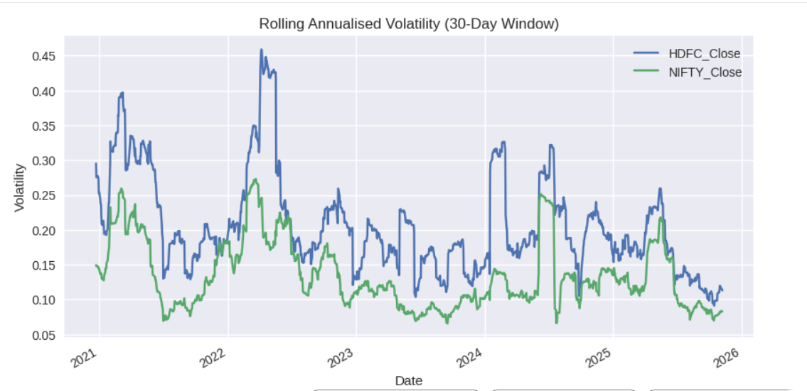
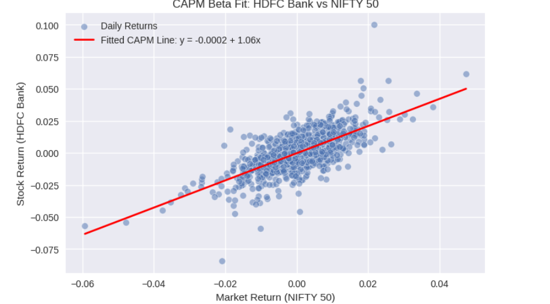

# financial-risk-analysis
Equity return and risk analysis using real market data (HDFC Bank vs NIFTY 50)

# Equity Return & Risk Analysis: HDFC Bank vs NIFTY 50
In this notebook, I’m exploring how HDFC Bank’s stock behaves compared to the broader Indian market (represented by the NIFTY 50 index). 
The goal is not to predict prices, but to understand **how risky or stable the stock is**, how it moves relative to the market, and what that means in terms of **investment behavior**.

This project helped me connect finance theory (daily returns, volatility, CAPM beta) with real market data.

# What are Daily Returns?

Instead of just looking at price changes, we use **returns** because they tell us the percentage movement of the asset.
For example, a ₹10 increase means something very different when the stock is at ₹100 versus ₹1,000.
Daily Return = (Today's Price - Yesterday's Price) / Yesterday's Price
Returns let us compare different assets on the same scale, so we can analyze their behavior more fairly.

# Understanding the Price Trend
This plot shows how HDFC Bank and the NIFTY 50 index have moved over time.
If both lines move in the same general direction, it suggests that the stock tends to follow the broader market sentiment.
We’re not trying to predict the future here — we are simply observing behavior.

# What is Volatility and Why Does It Matter?
Volatility tells us how *wildly* the price moves. 
- High volatility = frequent ups and downs → more uncertainty → higher risk.
- Low volatility = smoother movements → more stability → lower risk.

By looking at **30-day rolling volatility**, we can see how the risk of HDFC Bank has changed through time — not just at one moment.
This helps us understand market stress periods (like COVID crash or rate hike periods).

# Understanding CAPM Beta
Beta tells us how much the stock moves relative to the overall market.

- If Beta > 1 → The stock moves *more* than the market (more sensitive).
- If Beta < 1 → The stock moves *less* than the market (more stable).
- If Beta ≈ 1 → The stock tends to follow the market closely.

So, Beta is like the "personality" of the stock compared to the market.
It helps answer: "Does this stock behave aggressively or calmly when the market changes?"

## 📊 Visual Insights

| Price Trend | Rolling Volatility | CAPM Regression Fit |
|------------|-------------------|---------------------|
|  |  |  |

# Summary & Takeaways

From this analysis:
- HDFC Bank and NIFTY 50 show **similar long-term direction**, meaning HDFC is broadly aligned with market trends.
- The volatility chart highlights periods where the stock was more uncertain — these often match larger market events.
- The CAPM Beta gives a clear sense of how sensitive HDFC Bank is to overall market movement.

This kind of analysis is helpful for:
- Understanding **risk**
- Comparing stocks with the market
- Making informed, data-backed investment decisions
- CAPM Beta of HDFC Bank vs NIFTY 50: 1.06

For me, this project helped link the *concepts* I studied (returns, volatility, beta) with **real market data**, making the theory actually “click.”
## Tools Used
- Python
- yfinance
- pandas
- numpy
- matplotlib
 ## Author
Khushi  

